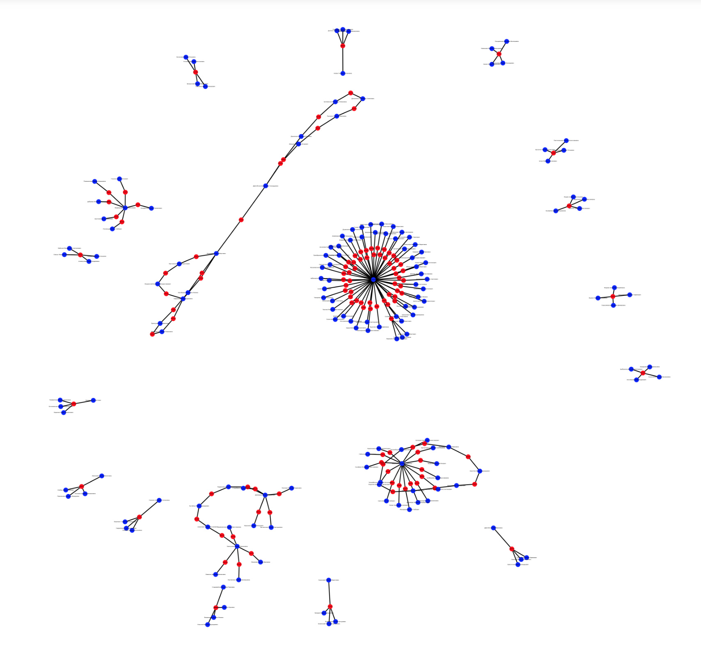

## Project: neo4j_db

## Graph database test task

#### Подготавливаем софт

- устанавливаем ipynb
- устанавливаем neo4j и GDS из репозитория https://github.com/neo4j билдим согласно документации в репозитории
- библиотеки pandas, neo4j, networkx пакетным менеджером pip

#### Парсим данные из csv в neo4j

- должен быть запущен neo4j на 7687 порту
- имя файла `data_test.csv` должен лежать в одной директории со скриптом
- запускаем скрипт, переходим на localhost:7474, авторизуемся, проверяем

#### Запросы neo4j на языке Cypher

Запускаем в терминале интерактивный режим Cypher Shell командой `cypher-shell`, авторизуемся
Попросит ввести `user` и `password` 
или 
`:connect bolt://localhost:7687 -u neo4j -p password` 

- Выводим 10 участников с максимальным количеством событий:
  `MATCH (p:Participant)-[r:PARTICIPATED_IN]->()` 
  `RETURN p.fio, COUNT(r) AS event_count` 
  `ORDER BY event_count DESC` 
  `LIMIT 10` 

- Вывести всех участников, которые участвовали в событии с заданным id:
  `MATCH (p:Participant)-[:PARTICIPATED_IN {event_id: $event_id}]->(e:Event)` 
  `RETURN p.fio` 

- Вывести все события в которых участвовал заданный участник:
  `MATCH (p:Participant {fio: $participant_name})-[:PARTICIPATED_IN]->(e:Event)` 
  `RETURN e.id_sobytiya` 

#### Выявление и анализ сложных сообществ

- Начал анализ с выявления сообществ, вывел в читабельном json. Изучив данные визуально заметил и обратил внимание, что
  элементов в сообщество 221 больше чаще в остальных сообществах
- Далее для поиска сложных сообществ я вывел количество элементов в каждом сообществе, предварительно отсортировав при
  помощи библиотеки Count
- Следующим шагом отрисовал граф только сложных сообществ, удалив из графа узлы, которые состоят в "простых"
  сообществах (посчитал сообщества простыми, если оно имеет 3 и менее элементов).
- На выведенном графе видны элементы сложных сообществ. Узлы "event" покрашены в красный цвет, а узлы "participant"
  окрашены в синий цвет.
- Посмотрев на визуальное представление графа заметил, что некоторые участники принимали участия во множестве встреч,
  некоторые встречались несколько раз. Также были встречи в которых участвовали 4 участника.

#### Rest-API

Для реализации этой части задания использовал фреймворк Flask. 
Чтобы запустить сервер, необходимо выполнить в терминале `python3 flask-rest.py` 

Реализовано два способа отправки POST запроса.

- простой UI интерфейс с возможностью ввода данных в форму 
  `http://127.0.0.1:5000/search` 

- или curl-запрос из терминала со строкой для поиска `curl -X POST -H "Content-Type: text/plain" -d "Галчевская Карина
  Владимировна" http://localhost:5000/search` 
